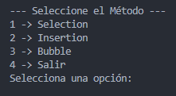
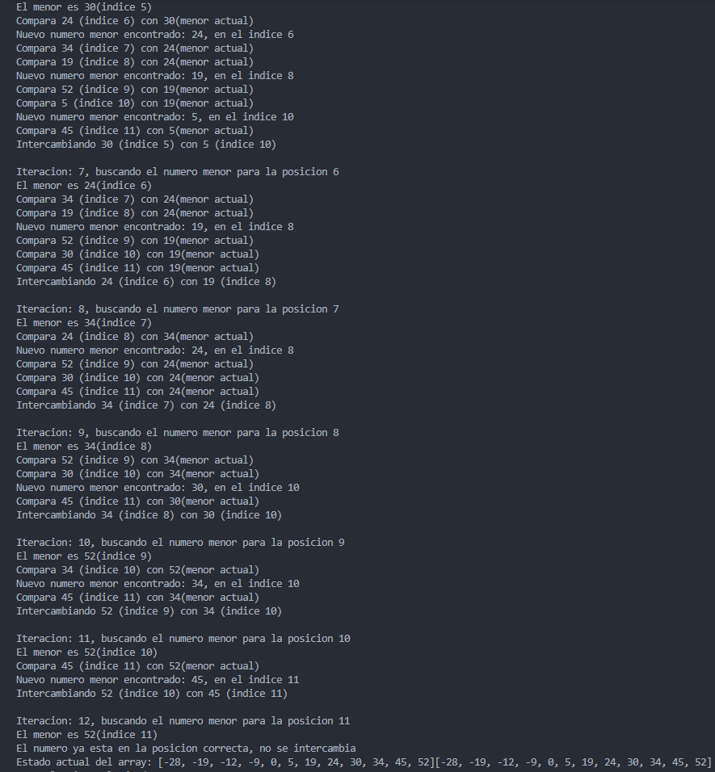
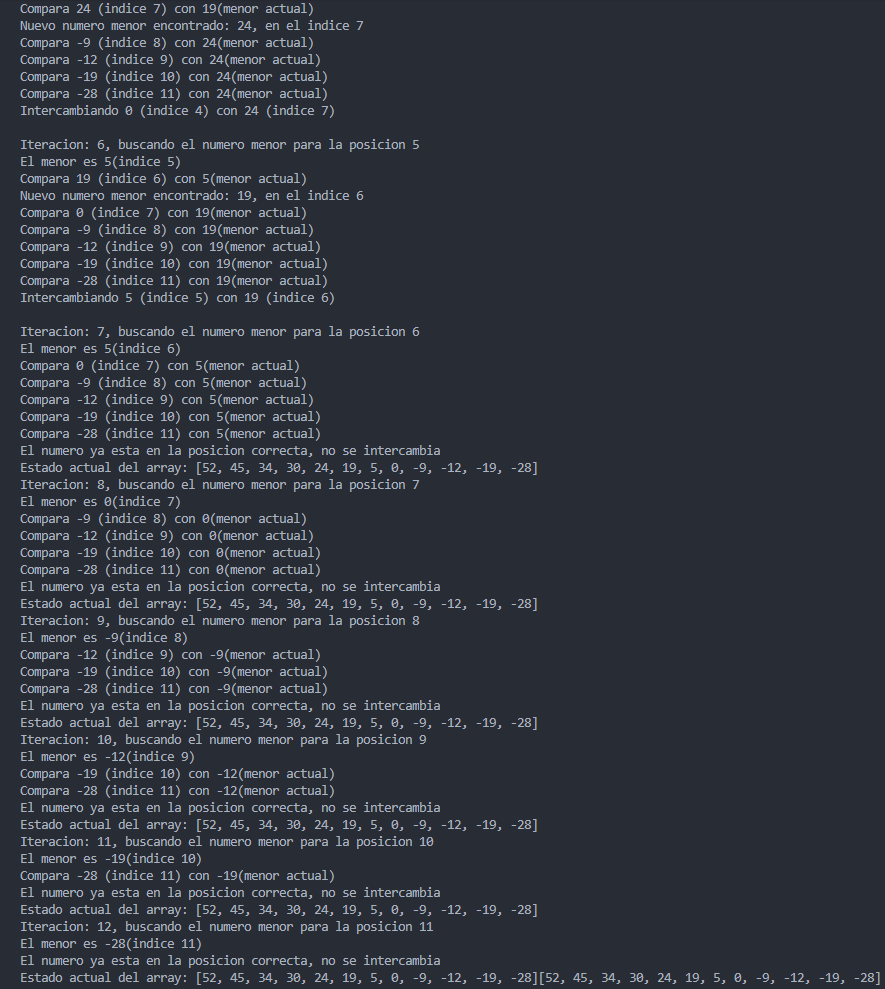
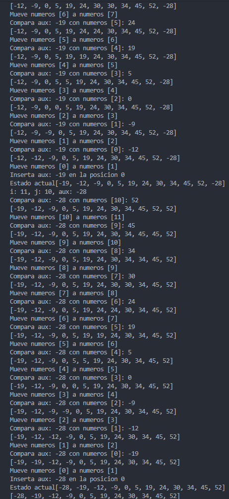
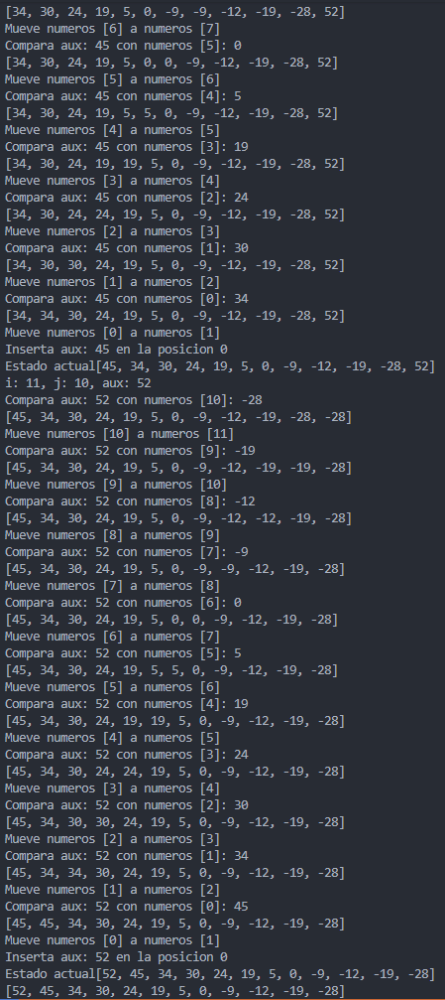
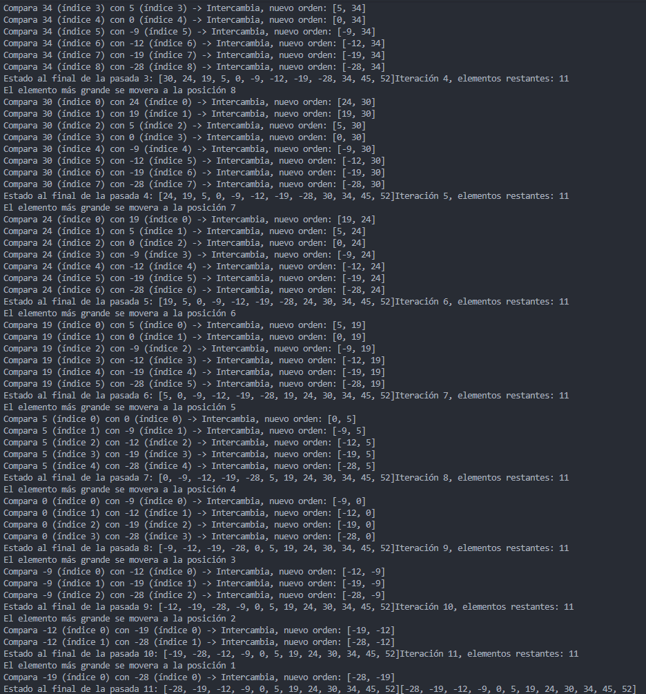
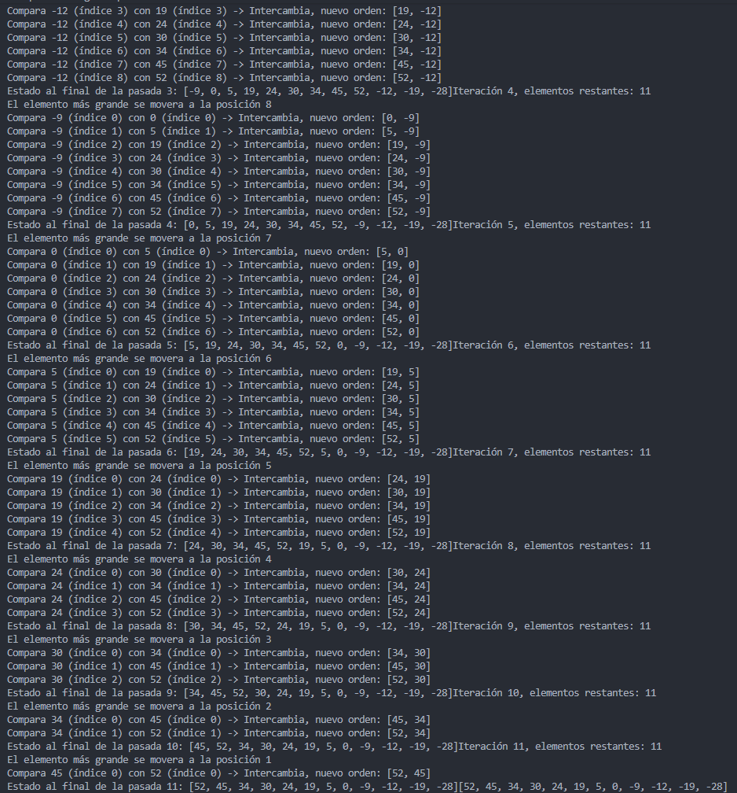

# *Universidad Politécnica Salesiana*

## Práctica 1: Algoritmos de Ordenamiento

*Asignatura:* Estructura de Datos 
*Docente:* Ing. [cite_start]Pablo Torre [cite: 107]
*Estudiante:* [AQUÍ VA TU NOMBRE COMPLETO]

---

## Capturas de la práctica

- ### *Menú con los métodos*

---

- ### *Método Selección*

#### Ascendente

#### Descendente

---

- ### *Método Inserción*

#### Ascendente

#### Descendente

---

- ### *Método Burbuja*

#### Ascendente

#### Descendente

---

## Conclusion 

Al finalizar esta práctica se implementaron exitosamente los métodos de ordenamiento Selección, Inserción y Burbuja Mejorado.

Hubo una mejor comprensión en los métodos, a la hora de implementar los pasos y al momento de programarlos, pues con los pasos se logra visualizar como funciona y trabaja cada método acorde al arreglo que se ingrese.